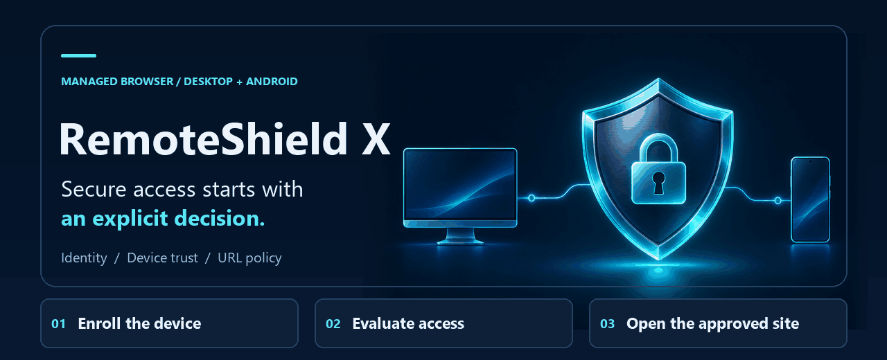
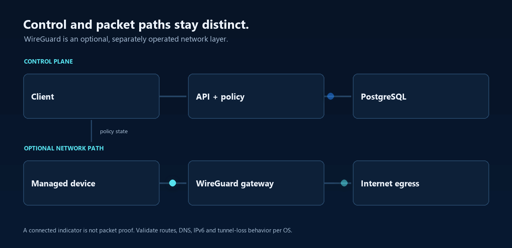

<picture>
  <source media="(prefers-reduced-motion: reduce)" srcset="assets/readme/remoteshield-hero.webp">
  
</picture>

# RemoteShield X

**Managed browsing and tenant-scoped access for remote teams.**

[](docs/ROADMAP.md) [](docs/ARCHITECTURE.md) [](docs/API_REFERENCE.md)

RemoteShield X lets an organization manage browser sessions, device enrollment, URL policy and security events from one console. A Node.js control plane handles identity and records decisions. Native WebViews load permitted pages. An independently managed WireGuard deployment and operating-system policy control how packets leave managed devices.

[Static, reduced-motion edition](docs/README_STATIC.md) · [Getting started](docs/GETTING_STARTED.md) · [Technical report](output/pdf/RemoteShield-X-Technical-Report.pdf) · [PowerPoint briefing](docs/deliverables/RemoteShield-X-Company-Briefing.pptx)

The [Phase 15 deliverable validation record](docs/deliverables/README.md) documents asset, link, command and rendering checks.

## What RemoteShield X is

RemoteShield X is an enterprise-oriented managed browser and access-control project. It combines browser clients with an organization-aware control plane for identity, policy decisions, device enrollment, sessions, and security events. Operators may pair it with a separately managed WireGuard gateway and operating-system routing controls. Browser policy decisions and a VPN connection indicator are not proof that every device packet follows the tunnel.

The project targets teams that need a central view of who is enrolled, which browser destinations are allowed, and what access events were recorded. It is still undergoing security remediation and operational acceptance; review the open gates below before evaluating it for a sensitive deployment.

## Published application downloads

The latest published stable GitHub release currently visible is **`v2.4.0`**, published **2026-04-18**. The links below are the nine assets attached to that release, grouped by platform. They are a historical inventory: the release tag is unsigned, the desktop installer filenames identify version `2.2.4` while the tag is `v2.4.0`, and the available evidence does not establish that these packages correspond to the current audited source. SHA-256 values identify the downloaded bytes; they do not verify publisher identity or safety.

| Platform | Release asset | SHA-256 |
| --- | --- | --- |
| Android ARM64 | [app-arm64-v8a-release.apk](https://github.com/manikantbindass/RdPBrowser/releases/download/v2.4.0/app-arm64-v8a-release.apk) | `50a791e82f3a2aa845f2b37fe9158dbab17c879147d6306a7650df3c30f7cf18` |
| Android ARMv7 | [app-armeabi-v7a-release.apk](https://github.com/manikantbindass/RdPBrowser/releases/download/v2.4.0/app-armeabi-v7a-release.apk) | `631ce08c1d3cd037848217ab754dd1d4b2ba7270e810193a55e71cd2f4e2eb1b` |
| Android x86-64 | [app-x86_64-release.apk](https://github.com/manikantbindass/RdPBrowser/releases/download/v2.4.0/app-x86_64-release.apk) | `c87aa8db0a8fc12617c67240b7cb1d75aa04c2dbdc8b2d9971ebfc72bb91d33d` |
| Linux x86-64 Arch archive | [RemoteShield-Linux-Arch-x86_64.tar.gz](https://github.com/manikantbindass/RdPBrowser/releases/download/v2.4.0/RemoteShield-Linux-Arch-x86_64.tar.gz) | `9a2f9c5216e28d077f53251114252a95d98cecd2e279f34cc45dcbbf64cd7e57` |
| Linux x86-64 AppImage | [RemoteShield.X_2.2.4_amd64.AppImage](https://github.com/manikantbindass/RdPBrowser/releases/download/v2.4.0/RemoteShield.X_2.2.4_amd64.AppImage) | `6c6e29585c87f225f5eb71c17b9b599aaed322329d83b83af0ce19d58b020604` |
| Debian/Ubuntu x86-64 | [RemoteShield.X_2.2.4_amd64.deb](https://github.com/manikantbindass/RdPBrowser/releases/download/v2.4.0/RemoteShield.X_2.2.4_amd64.deb) | `ef81523e5f7719dcf6dec362f6d53bfb78a4ae91383a177735b16154da1d2b29` |
| macOS universal DMG | [RemoteShield.X_2.2.4_universal.dmg](https://github.com/manikantbindass/RdPBrowser/releases/download/v2.4.0/RemoteShield.X_2.2.4_universal.dmg) | `c414a5e22c01c7b405def7afd8cc43a9fc6d837364d0f2483c930e9308136417` |
| Windows x86-64 installer | [RemoteShield.X_2.2.4_x64-setup.exe](https://github.com/manikantbindass/RdPBrowser/releases/download/v2.4.0/RemoteShield.X_2.2.4_x64-setup.exe) | `e4fef0d8518f05f406e0dea03c6a05688b2bf5a2656ce07fd7e61eb7af976489` |
| Windows x86-64 MSI | [RemoteShield.X_2.2.4_x64_en-US.msi](https://github.com/manikantbindass/RdPBrowser/releases/download/v2.4.0/RemoteShield.X_2.2.4_x64_en-US.msi) | `3b340fc9a530e0f39d782bdeb12b92d1d0212a3d3e79040c896334bd24f34c0b` |

[Open the GitHub release](https://github.com/manikantbindass/RdPBrowser/releases/tag/v2.4.0) · [Machine-readable release inventory and audit notes](docs/audit/phase16/release-assets-v2.4.0.json)

There is no published iOS package in this release. The `v2.5.0-preview.4` source preview is not a GitHub Release and has no published release assets. Do not infer a supported platform or current-source compatibility from an asset filename. Inspect and verify downloaded binaries under your organization’s software intake process before use.

## Motion and visual documentation

These original, repository-built loops illustrate product boundaries and workflows. They are conceptual diagrams, not a demonstration of a running security control. The four GIFs loop continuously; static WebP alternatives are linked for readers whose Markdown viewer blocks animation. The top hero honors the reduced-motion media query where the renderer supports `<picture>`; the static README is available at any time.

### Access decision and browser traffic boundary

<picture>
  <source media="(prefers-reduced-motion: reduce)" srcset="assets/readme/remoteshield-access-flow.webp">
  
</picture>

### Optional VPN enforcement boundary

<picture>
  <source media="(prefers-reduced-motion: reduce)" srcset="assets/readme/remoteshield-network-boundary.webp">
  
</picture>

Rebuild all illustrations and loop assets with `python scripts/build_readme_assets.py`. See [animation source, timings, and accessibility notes](assets/readme/README.md); no remote animation service is used.

## Implementation and evidence

| Area | Implemented and verified | Acceptance still open |
| --- | --- | --- |
| Backend | Versioned REST, PostgreSQL migrations and tenant isolation, refresh rotation, revocation, URL policy, audit and events. Hosted run passed 156 unit and 48 database integration tests. | Review remaining static analysis findings and verify the deployment with the intended users and load. |
| Desktop | Tauri 2, Rust, React and TypeScript. Windows, Linux and Intel macOS native checks passed. The preview built Windows and Linux x64 installers and a universal macOS DMG. | Production signatures, notarization, native install and upgrade acceptance, and per-OS network enforcement. |
| Android | Flutter client with secure refresh storage, device key possession and WebView policy checks. Android 16/API 36 emulator boundary tests and four preview APK builds are recorded. | Physical managed-device acceptance, provisioned lockdown, signed distribution and native enterprise SSO handoff. |
| Network | Per-device WireGuard peers, Linux gateway and client firewall, IPv4/IPv6 routing, DNS and tunnel failure tests in isolated namespaces. | Packet verification of the operator’s complete topology and each managed OS profile. |
| Administration | Tenant-scoped users, devices, sessions, policies, incidents, governance and evidence export. Nine admin browser scenarios passed. | Live identity-provider tenants, independent evidence retention and operational staffing. |
| Delivery | Blocking PR matrix, protected signing and publication, SBOMs, checksums and provenance. The artifact-only preview independently verified all 16 entries. | Five firewall configuration findings, 52 backend static analyzer findings and production signing credentials. |

The verification snapshot uses source commit `8d0f7da` and preview `v2.5.0-preview.4`. The ten passing jobs include 35 Compose deployment and recovery assertions. The required quality gate failed on the two remaining scan jobs. The latest published stable release at this snapshot was `v2.4.0`. [Hosted checks](https://github.com/manikantbindass/RdPBrowser/actions/runs/44484220465) · [Preview verification](https://github.com/manikantbindass/RdPBrowser/actions/runs/44484271833/job/135432691439) · [Audit evidence](docs/audit/phase14/security-remediation.json)

## Architecture


Nginx terminates TLS. Express and Socket.IO handle authenticated control traffic. PostgreSQL stores organization, identity, device, session, policy and event state. A restricted runtime role and forced row-level security protect tenant data. The browser loads destination pages through the OS network stack; `/api/v1/proxy/navigate` returns an authorization decision.

[Architecture](docs/ARCHITECTURE.md) · [API reference](docs/API_REFERENCE.md) · [Security model](docs/SECURITY_MODEL.md) · [Threat model](docs/THREAT_MODEL.md)

## Real application captures

| Windows desktop | Administration console |
| --- | --- |
|  |  |
| Archived development capture from `ae49ba4`. Its placeholder infrastructure labels are illustrative. | Phase 09 browser acceptance fixture. Counts describe seeded lab records. |

The [capture ledger](assets/readme/SCREENSHOTS.md) also records the [device inventory](assets/readme/device-management.png) and [policy revision](assets/readme/policy-management.png) views. Android evidence currently covers build, emulator boundary tests and packaging. A managed Android screenshot awaits a provisioned fixture and an approved capture method.

## Platform and setup

Use Node 24 for the backend and shared development workflow, Python 3.10 or later for verification, and Docker Compose 2.24.4 or later in Linux-container mode. The desktop build supports Node 22.12 or later and the native Tauri prerequisites. Android uses Flutter 3.38.9, Java 17, minimum SDK 26 and compile/target SDK 36. The tested Android runtime was API 36 on an emulator. [Setup and platform requirements](docs/GETTING_STARTED.md)

In a fresh checkout on the development branch:

```sh
node scripts/setup-dev.mjs
npm ci --prefix backend
npm run config:check --prefix backend
docker compose --env-file docker/.env -f docker/docker-compose.yml -f docker/compose.dev.yml up -d --build --wait
```

Open `http://127.0.0.1:8180/admin/` and check backend readiness on `127.0.0.1:3001/ready`. The local stack publishes loopback ports and permits direct API access. The setup script creates local credentials once. An operator must provision the first administrator. [Bootstrap instructions](docs/GETTING_STARTED.md)

## Operating RemoteShield X

- [Deployment](docs/DEPLOYMENT.md) covers the single-VPS Compose topology, WireGuard, TLS, backups, recovery and capacity boundaries.
- [Administrator guide](docs/ADMIN_GUIDE.md) covers identity setup, device enrollment, policy revisions, incident response and audit export.
- [User guide](docs/USER_GUIDE.md) covers connection requirements, desktop and Android workflows, revocation and logout.
- [Testing](docs/TESTING.md) explains how to reproduce the evidence and distinguish a passing check from production acceptance.
- [Troubleshooting](docs/TROUBLESHOOTING.md) covers startup, admission, VPN, policy, and release failures.
- [Release process](docs/RELEASE_PROCESS.md) defines preview, signed RC, stable publication and rollback.
- [Roadmap](docs/ROADMAP.md) tracks remaining release, platform and operations acceptance.

Use [CONTRIBUTING.md](CONTRIBUTING.md) for development changes, [SECURITY.md](SECURITY.md) for vulnerability reporting, and [repository metadata](docs/REPOSITORY_METADATA.md) for the suggested GitHub description and topics. Package manifests declare MIT. The repository owner still needs to establish the standalone licensing record.

<picture>
  <source media="(prefers-reduced-motion: reduce)" srcset="assets/readme/remoteshield-footer.webp">
  
</picture>
